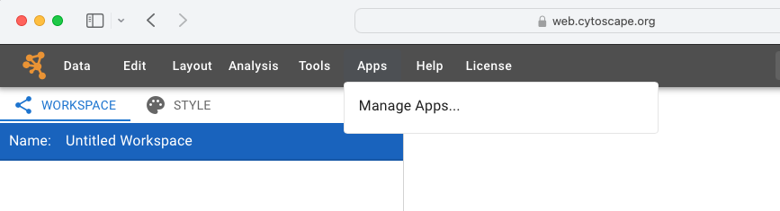
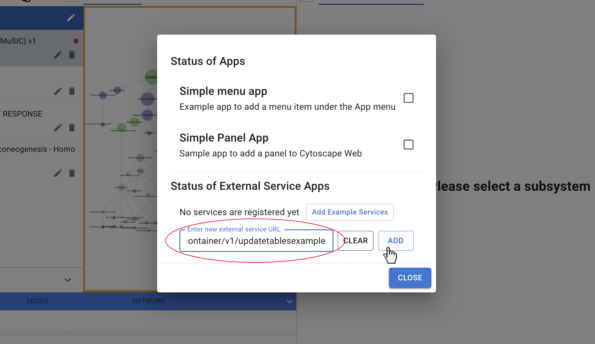
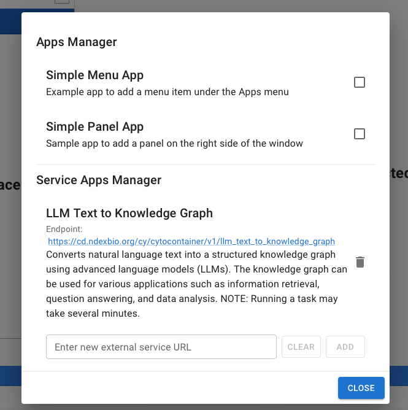
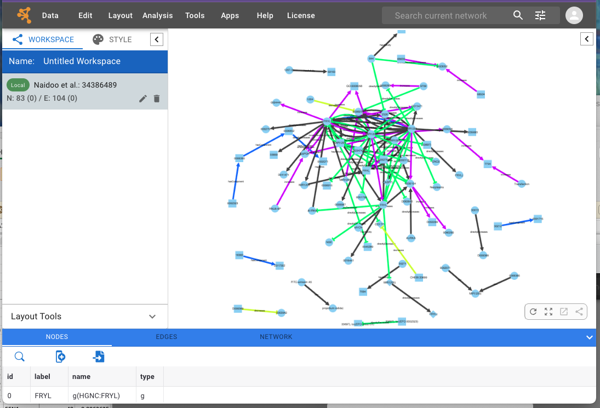

# How-To: textToKnowledgeGraph on Cytoscape Web App

**textToKnowledgeGraph** is available as a [Cytoscape Web Service App](https://cytoscape-web.readthedocs.io/en/latest/Extending.html#service-apps)

**------->We have encountered bugs using Safari, currently investigating.<-----**

 The app enables you to process a paper specified by its [PubMed Central ID](https://en.wikipedia.org/wiki/PubMed_Central#PMCID), creating the knowledge grap in Cytoscape Web's workspace.

Cytoscape Web can be used without logging in, but if you go to [NDEx](www.ndexbio.org) and create an account, you will be able to save and share the knowledge graphs that you create.

## Installing the textToKnowledgeGraph App

Service Apps are installed using the URL of the service. You do this via the App menu, selecting Manage Apps. (
[Click here for full documentation on Service Apps](https://cytoscape-web.readthedocs.io/en/latest/Extending.html#service-apps))

In the Manage Apps dialog, enter this URL:

https://cd.ndexbio.org/cy/cytocontainer/v1/llm_text_to_knowledge_graph

The dialog should now display the installed app:

    

## Using the App

In the textToKnowledgeGraph dialog, enter a [PubMed Central ID](https://en.wikipedia.org/wiki/PubMed_Central#PMCID) with **PMC** prefix.

Processing the paper may take a while! Cytoscape Web waits for the service to respond with the knowledge graph, expect it to take a few minutes.

Here's the result of processing the default PMC ID, but try it with something interesting to you. It will do best with papers focused on molecular relationships.

## Cytoscape Web

[Cytoscape Web](https://web.cytoscape.org) is an online implementation that captures the interface and key visualization functionality of the Cytoscape desktop application [cytoscape.org](https://cytoscape.org) while providing integration with web tools and databases

Ono, et al., Cytoscape Web: bringing network biology to the browser, Nucleic Acids Research, Volume 53, Issue W1, 7 July 2025, Pages W203–W212, https://doi.org/10.1093/nar/gkaf365

## Service Apps

The Cytoscape Web Service App framework enables developers to register a REST service with Cytoscape Web to extend its functionality. The Service App REST service specification lets service developers specify the UI for inputs that their service requires without writing TypeScript code in Cytoscape Web. A Service App can be added to Cytoscape Web by simply pasting the URL in the Apps > Manage Apps … menu. Once the service is registered, Cytoscape Web will automatically process the JSON object received from the metadata endpoint of the service and generate the corresponding menu items. When a user runs the service, a dialog window appears to collect specified inputs. After the service completes, Cytoscape Web applies any actions defined by the service to the returned results. For instance, the “Update tables example” Service App (https://github.com/idekerlab/enrichment_service) applies the updateTables operation to the service results, which adds or updates columns in the nodes or edges table of the current network. Additional actions include opening a URL in a new tab, adding a new network, and updating a network’s selection, content, and layout. The status of installed App and Service Apps is stored in the workspace settings. It is automatically saved when the workspace is saved and restored when the workspace is reloaded.

